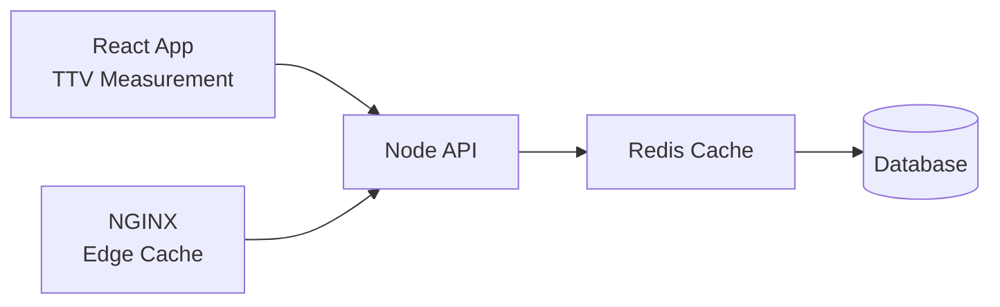

# Scalability Labs

A collection of focused projects demonstrating how backend load impacts **user-perceived performance**, and how different layers of optimization improve it.

This series connects frontend metrics (React) with backend scalability (Node.js), caching (Redis), and edge optimization (NGINX).

## 🧠 Core Idea

Instead of measuring only API latency, these projects focus on:

> **Time-To-Visible (TTV)** — how long it takes for a meaningful UI element to appear for the user.

This provides a more realistic view of performance under load.

## 🏗️ Architecture

## 📦 Projects

### 1. React TTV Visibility Demo
**Repo:** https://github.com/bganguly/react-ttv-visibility-demo

- Tracks visibility of a DOM node using IntersectionObserver
- Measures Time-To-Visible (TTV)
- Sends metrics to backend

### 2. Node Load Testing (k6)
**Repo:** https://github.com/bganguly/node-load-testing-k6

- Simulates backend load using k6
- Measures:
  - Latency (p95)
  - Throughput
  - Error rate

### 3. Redis Caching Demo
**Repo:** https://github.com/bganguly/redis-caching-demo

- Adds Redis caching to reduce backend load
- Demonstrates performance improvement under load

### 4. CDN Simulation (NGINX)
**Repo:** https://github.com/bganguly/cdn-simulation-nginx

- Simulates edge caching using NGINX
- Reduces backend hits and improves response time

## 📊 Results Summary

| Scenario        | Load (Concurrent Users) | Time-To-Visible |
|----------------|------------------------|-----------------|
| No Cache       | 500                    | ~1200ms         |
| Redis Cache    | 500                    | ~500ms          |
| CDN Simulation | 500                    | ~250ms          |

## 🔥 Key Learnings

- Backend latency directly impacts frontend user experience
- Caching significantly reduces system load and improves responsiveness
- Moving caching closer to the user (CDN) provides the biggest gains
- Measuring real user metrics (TTV) is more meaningful than raw API timing

## 🧪 How to Run

Each project contains its own setup instructions.

Typical flow:

1. Start backend service
2. Run load test (k6)
3. Open React app
4. Observe Time-To-Visible under load

## 🧭 Why This Matters

Modern applications are judged by **user experience**, not just backend performance.

This project demonstrates how to:
- Measure real UX metrics
- Identify bottlenecks
- Apply practical optimizations
- Validate improvements under load

## 📌 Future Improvements

- Add real database layer (Postgres)
- Add distributed caching
- Deploy to cloud with real CDN (e.g., Cloudflare)
- Add observability (Grafana / Prometheus)
